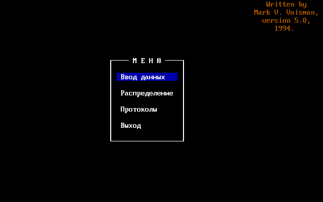
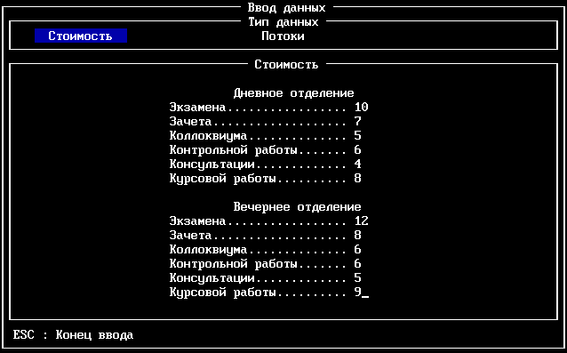
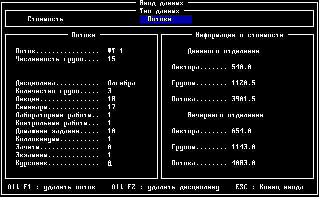
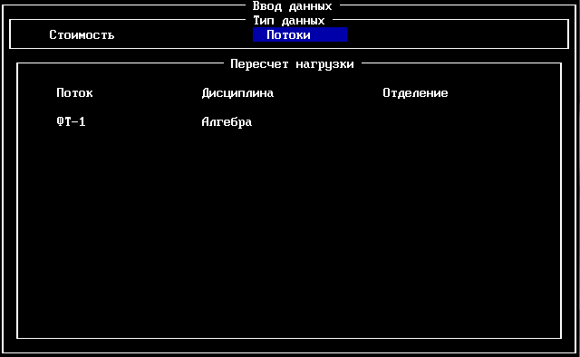
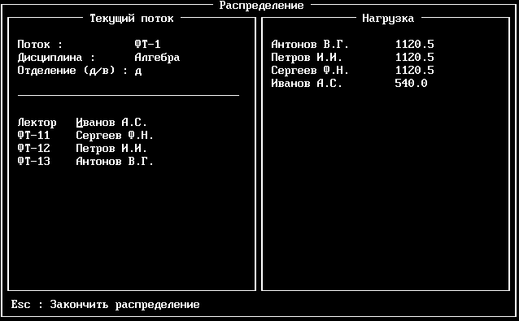
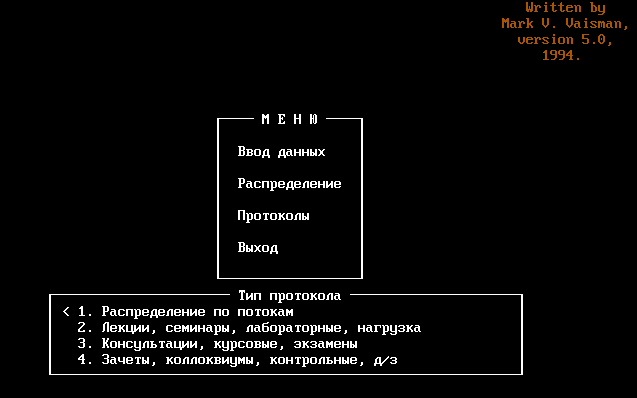
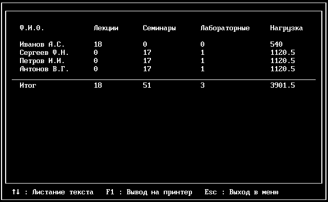
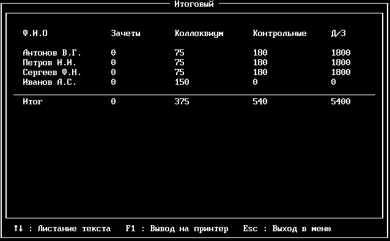

Приложение для распределения академических часов среди преподавателей кафедры высшей математики 2 МИЭТ.

Была написана на Turbo Prolog 2.0 в далёком 1994 г. и прослужила многие годы, помогая в работе заведующему кафедры Кальнею Сергею Григорьевичу.

